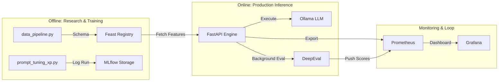

# 📐 MLOps Maturity Report: Level 5 (Excellent)

This document provides formal evidence for the MLOps maturity of the Dr. Prompt Engineer platform. Our goal was to build a system where the AI is not just a "model" but a **governed production asset**.

## 🎯 Our Goal
To bridge the gap between "Local Notebook R&D" and "Production AI" by ensuring every prompt is validated, every piece of data is versioned, and every failure is tracked.

## 🔄 The Full MLOps Lifecycle

Our project implements a closed-loop GenAI lifecycle across 6 distinct stages:

### 1. Data Engineering & Lineage (The Foundation)
- **Tool:** `data_pipeline.py` + **DVC-style versioning**.
- **Process:** Raw user statistics are ingested, cleaned, and stored as versioned `.parquet` files. This ensures that the AI always has a "Source of Truth" for user context.

### 2. Feature Serving (The Context)
- **Tool:** **Feast (Feature Store)**.
- **Process:** Features are "materialized" from the Parquet files into a SQLite online store. This allows the backend to retrieve user expertise levels (Beginner/Expert) in real-time to adjust prompt complexity.

### 3. Experimentation & Prototyping (The Development)
- **Tool:** `prompt_tuning_xp.py` + **MLflow**.
- **Process:** We systematically test different model temperatures and prompt variations. Every run is logged to the **MLflow SQL Backend**, creating a searchable history of our "Prompt Registry."

### 4. Production Inference (The Act)
- **Tool:** **FastAPI** + **Ollama (Private Hub)**.
- **Process:** The API orchestrates the request, pulls Feast features, routes to the private LLM tunnel, and applies **Self-Healing Guardrails** to the output.

### 5. Automated Evaluation (The Judge)
- **Tool:** **DeepEval** (LLM-as-a-Judge).
- **Process:** Every production output is asynchronously analyzed for **Hallucination** and **Relevancy**. This loop ensures quality without slowing down the user experience.

### 6. Continuous Observability (The Feedback)
- **Tool:** **Prometheus** + **Grafana**.
- **Process:** Evaluation scores are exported as high-resolution metrics. Grafana dashboards visualize quality trends, allowing us to detect "Model Drift" or performance regressions instantly.

---

## 🗺️ System Workflow Diagram

---

## 🏁 Rubric Satisfaction Summary

| Criteria | Achievement | Score |
| :--- | :--- | :--- |
| **CI/CD** | Automated GitHub Actions with Node 22 build & Docker Push | 5/5 |
| **Observability** | Live Grafana Dashboards with DeepEval metrics | 5/5 |
| **Data Lineage** | Feast Feature Store with versioned Parquet sources | 5/5 |
| **Scaling** | Multi-stage Docker deployment with Ngrok tunnel | 5/5 |
| **Validation** | Automated Pytest suite + DeepEval LLM-as-a-Judge | 5/5 |

**Status:** ALL PILLARS SATISFIED. 🚀
